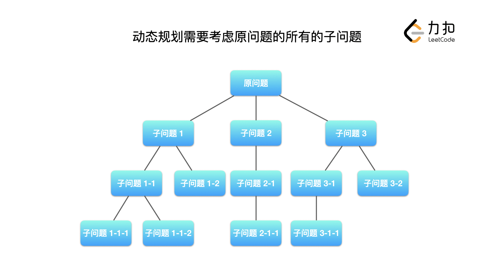

## 贪心算法
贪心算法是指在求解问题时，总是做出当前看来最好的选择。基于问题的特点，
可以少考虑很多动态规划算法需要考虑的子问题，通过递推得到全局问题的解。
## 概述
贪心算法是对完成一件事情的方法的描述，贪心算法每一次都做出当前看起来最好的选择，
而不用考虑其它可能的选择。

贪心算法的学习可以与动态规划算法进行比较，看看它到底比动态规划算法少考虑了哪些子问题，
为什么可以少考虑那些子问题，而每次只专注于求解一个子问题，通过逐步递推得到原问题的答案。

## 贪心算法的理论知识
### 贪心算法与回溯算法、动态规划的区别
「解决一个问题需要多个步骤，每一个步骤有多种选择」这样的描述我们在「回溯算法」「动态规划」算法中都会看到。它们的区别如下：

「回溯算法」需要记录每一个步骤、每一个选择，用于回答所有具体解的问题；
「动态规划」需要记录的是每一个步骤、所有选择的汇总值（最大、最小或者计数）；
「贪心算法」由于适用的问题，每一个步骤只有一种选择，一般而言只需要记录与当前步骤相关的变量的值。
对于不同的求解目标和不同的问题场景，需要使用不同的算法。动态规划与贪心算法的区别，
我们画在下面这张图里。

### 可以使用「贪心算法」的问题需要满足的条件
- 最优子结构：规模较大的问题的解由规模较小的子问题的解组成，区别于「动态规划」，可以使用「贪心算法」的问题「规模较大的问题的解」只由其中一个「规模较小的子问题的解」决定；
- 无后效性：后面阶段的求解不会修改前面阶段已经计算好的结果；
- 贪心选择性质：从局部最优解可以得到全局最优解。
对「最优子结构」和「无后效性」的理解同「动态规划」，「贪心选择性质」是「贪心算法」最需要关注的内容。

### 通过具体例子理解「贪心算法」
例：「力扣」第 455 题：分发饼干（简单）
假设你是一位很棒的家长，想要给你的孩子们一些小饼干。但是，每个孩子最多只能给一块饼干。

对每个孩子 i，都有一个胃口值 g[i]，这是能让孩子们满足胃口的饼干的最小尺寸；并且每块饼干 j，都有一个尺寸 s[j] 。如果 s[j] >= g[i]，
我们可以将这个饼干 j 分配给孩子 i ，这个孩子会得到满足。你的目标是尽可能满足越多数量的孩子，并输出这个最大数值。

示例 1:

    输入: g = [1,2,3], s = [1,1]
    输出: 1
    解释:
    你有三个孩子和两块小饼干，3个孩子的胃口值分别是：1,2,3。
    虽然你有两块小饼干，由于他们的尺寸都是1，你只能让胃口值是1的孩子满足。
    所以你应该输出1。

示例 2:

    输入: g = [1,2], s = [1,2,3]
    输出: 2
    解释:
    你有两个孩子和三块小饼干，2个孩子的胃口值分别是1,2。
    你拥有的饼干数量和尺寸都足以让所有孩子满足。
    所以你应该输出2.

提示：

    1 <= g.length <= 3 * 104
    0 <= s.length <= 3 * 104
    1 <= g[i], s[j] <= 2^31 - 1
