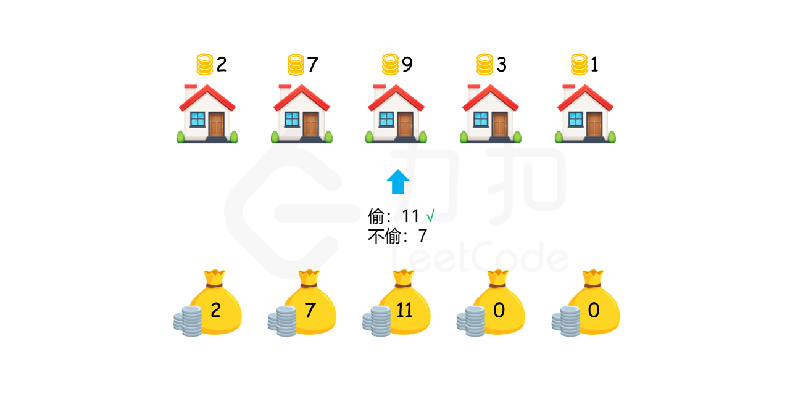

# 四月刷题

## [179. 最大数](Test1.java)

给定一组非负整数 nums，重新排列每个数的顺序（每个数不可拆分）使之组成一个最大的整数。

注意：输出结果可能非常大，所以你需要返回一个字符串而不是整数。

示例 1：

```
输入：nums = [10,2]
输出："210"
```

示例 2：

```
输入：nums = [3,30,34,5,9]
输出："9534330"
```

示例 3：

```
输入：nums = [1]
输出："1"
```

示例 4：

```
输入：nums = [10]
输出："10"
```

提示：

```
1 <= nums.length <= 100
0 <= nums[i] <= 10^9
```

<hr>

[783. 二叉搜索树节点最小距离](Test2.java)

给你一个二叉搜索树的根节点 root ，返回 树中任意两不同节点值之间的最小差值 。

[注意：](https://leetcode-cn.com/problems/minimum-absolute-difference-in-bst/)

`本题与 530：[https://leetcode-cn.com/problems/minimum-absolute-difference-in-bst/]相同
`

示例 1：


```
输入：root = [4,2,6,1,3]
输出：1
```

示例 2：


```
输入：root = [1,0,48,null,null,12,49]
输出：1
```

提示：

```
树中节点数目在范围 [2, 100] 内
0 <= Node.val <= 105
```

<hr>

## [213. 打家劫舍 II](Test3.java)
你是一个专业的小偷，计划偷窃沿街的房屋，每间房内都藏有一定的现金。这个地方所有的房屋都 围成一圈 ，这意味着第一个房屋和最后一个房屋是紧挨着的。同时，相邻的房屋装有相互连通的防盗系统，如果两间相邻的房屋在同一晚上被小偷闯入，系统会自动报警
。

给定一个代表每个房屋存放金额的非负整数数组，计算你 在不触动警报装置的情况下 ，能够偷窃到的最高金额。

示例 1：
```
输入：nums = [2,3,2]
输出：3 解释：你不能先偷窃 1 号房屋（金额 = 2），然后偷窃 3 号房屋（金额 = 2）, 因为他们是相邻的。
```
示例 2：
```
输入：nums = [1,2,3,1]
输出：4 解释：你可以先偷窃 1 号房屋（金额 = 1），然后偷窃 3 号房屋（金额 = 3）。 偷窃到的最高金额 = 1 + 3 = 4 。 
```
示例 3：
```
输入：nums = [0]
输出：0
```
提示：
```
1 <= nums.length <= 100 
0 <= nums[i] <= 1000
```

<hr>

## [198. 打家劫舍](Test4.java)
### 题
你是一个专业的小偷，计划偷窃沿街的房屋。每间房内都藏有一定的现金，
影响你偷窃的唯一制约因素就是相邻的房屋装有相互连通的防盗系统，
如果两间相邻的房屋在同一晚上被小偷闯入，系统会自动报警。

给定一个代表每个房屋存放金额的非负整数数组，计算你 不触动警报装置的情况下 
，一夜之内能够偷窃到的最高金额。


示例 1：
```
输入：[1,2,3,1]
输出：4
解释：偷窃 1 号房屋 (金额 = 1) ，然后偷窃 3 号房屋 (金额 = 3)。
偷窃到的最高金额 = 1 + 3 = 4 。
```

示例 2：
```
输入：[2,7,9,3,1]
输出：12
解释：偷窃 1 号房屋 (金额 = 2), 偷窃 3 号房屋 (金额 = 9)，接着偷窃 5 号房屋 (金额 = 1)。
偷窃到的最高金额 = 2 + 9 + 1 = 12 。
```

提示：
```
0 <= nums.length <= 100
0 <= nums[i] <= 400
```

### [解析](Test4.java)
首先考虑最简单的情况。如果只有一间房屋，则偷窃该房屋，可以偷窃到最高总金额。如果只有两间房屋，则由于两间房屋相邻，不能同时偷窃，只能偷窃其中的一间房屋，因此选择其中金额较高的房屋进行偷窃，可以偷窃到最高总金额。

如果房屋数量大于两间，应该如何计算能够偷窃到的最高总金额呢？对于第 k(k>2) 间房屋，有两个选项：

    1.偷窃第 k 间房屋，那么就不能偷窃第 k−1 间房屋，偷窃总金额为前 k−2 间房屋的最高总金额与第 kk 间房屋的金额之和。

    2.不偷窃第 k 间房屋，偷窃总金额为前 k−1 间房屋的最高总金额。

在两个选项中选择偷窃总金额较大的选项，该选项对应的偷窃总金额即为前 k 间房屋能偷窃到的最高总金额。

用 dp[i] 表示前 i 间房屋能偷窃到的最高总金额，那么就有如下的状态转移方程：

    dp[i]=max(dp[i−2]+nums[i],dp[i−1])

边界条件为：
    
    {
    dp[0]=nums[0]  只有一间房屋，则偷窃该房屋
    dp[1]=max(nums[0],nums[1]) 只有两间房屋，选择其中金额较高的房屋进行偷窃
    }


最终的答案即为dp[n−1]，其中 n 是数组的长度。



## a
a

## a