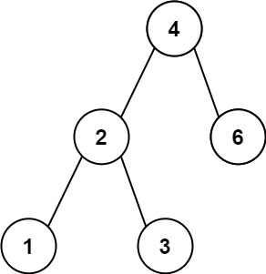
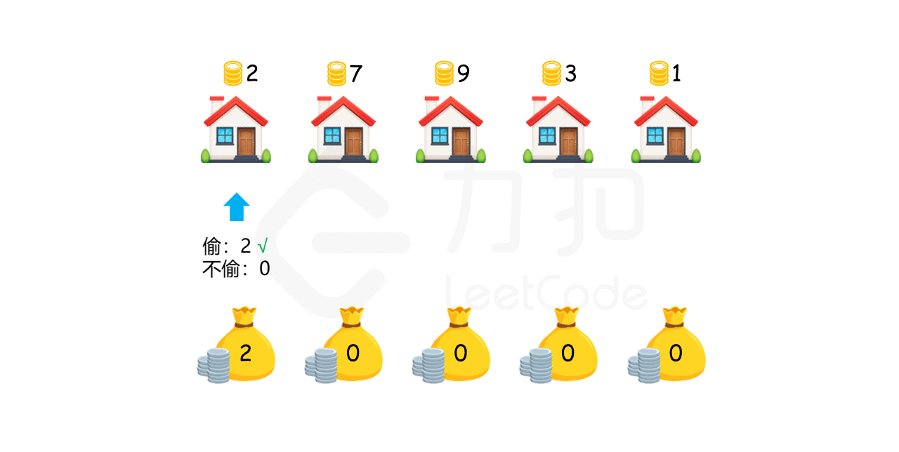
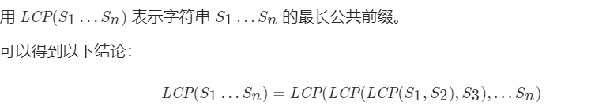
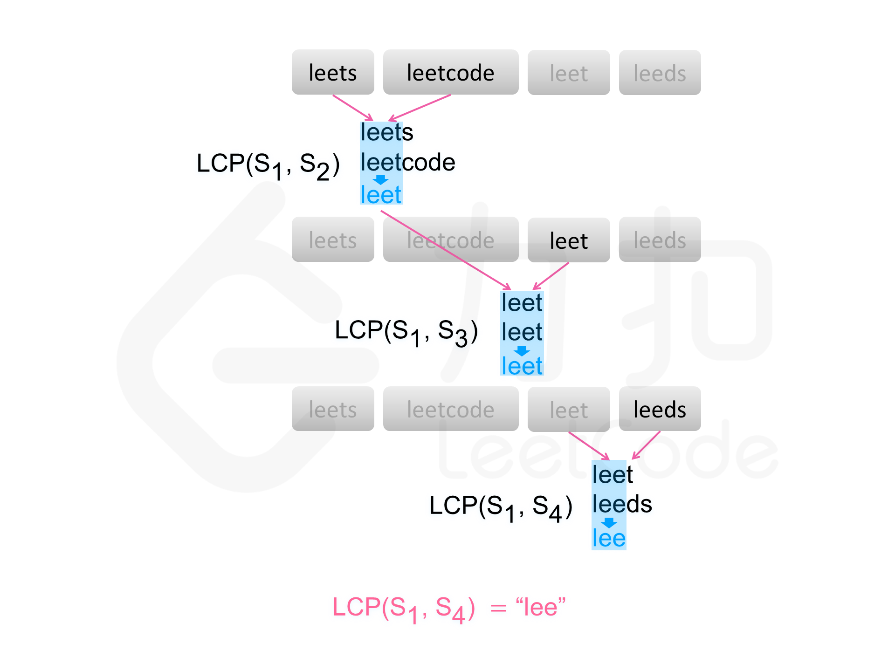

# 四月刷题

## [179. 最大数](Test1.java)

给定一组非负整数 nums，重新排列每个数的顺序（每个数不可拆分）使之组成一个最大的整数。

注意：输出结果可能非常大，所以你需要返回一个字符串而不是整数。

示例 1：

```
输入：nums = [10,2]
输出："210"
```

示例 2：

```
输入：nums = [3,30,34,5,9]
输出："9534330"
```

示例 3：

```
输入：nums = [1]
输出："1"
```

示例 4：

```
输入：nums = [10]
输出："10"
```

提示：

```
1 <= nums.length <= 100
0 <= nums[i] <= 10^9
```

<hr>

[783. 二叉搜索树节点最小距离](Test2.java)

给你一个二叉搜索树的根节点 root ，返回 树中任意两不同节点值之间的最小差值 。

[注意：](https://leetcode-cn.com/problems/minimum-absolute-difference-in-bst/)

`本题与 530：[https://leetcode-cn.com/problems/minimum-absolute-difference-in-bst/]相同
`

示例 1：



```
输入：root = [4,2,6,1,3]
输出：1
```

示例 2：


```
输入：root = [1,0,48,null,null,12,49]
输出：1
```

提示：

```
树中节点数目在范围 [2, 100] 内
0 <= Node.val <= 105
```

<hr>

## [213. 打家劫舍 II](Test3.java)

你是一个专业的小偷，计划偷窃沿街的房屋，每间房内都藏有一定的现金。这个地方所有的房屋都 围成一圈 ，这意味着第一个房屋和最后一个房屋是紧挨着的。同时，相邻的房屋装有相互连通的防盗系统，如果两间相邻的房屋在同一晚上被小偷闯入，系统会自动报警
。

给定一个代表每个房屋存放金额的非负整数数组，计算你 在不触动警报装置的情况下 ，能够偷窃到的最高金额。

示例 1：

```
输入：nums = [2,3,2]
输出：3 解释：你不能先偷窃 1 号房屋（金额 = 2），然后偷窃 3 号房屋（金额 = 2）, 因为他们是相邻的。
```

示例 2：

```
输入：nums = [1,2,3,1]
输出：4 解释：你可以先偷窃 1 号房屋（金额 = 1），然后偷窃 3 号房屋（金额 = 3）。 偷窃到的最高金额 = 1 + 3 = 4 。 
```

示例 3：

```
输入：nums = [0]
输出：0
```

提示：

```
1 <= nums.length <= 100 
0 <= nums[i] <= 1000
```

<hr>

## [198. 打家劫舍](Test4.java)

### 题

你是一个专业的小偷，计划偷窃沿街的房屋。每间房内都藏有一定的现金， 影响你偷窃的唯一制约因素就是相邻的房屋装有相互连通的防盗系统， 如果两间相邻的房屋在同一晚上被小偷闯入，系统会自动报警。

给定一个代表每个房屋存放金额的非负整数数组，计算你 不触动警报装置的情况下 ，一夜之内能够偷窃到的最高金额。

示例 1：

```
输入：[1,2,3,1]
输出：4
解释：偷窃 1 号房屋 (金额 = 1) ，然后偷窃 3 号房屋 (金额 = 3)。
偷窃到的最高金额 = 1 + 3 = 4 。
```

示例 2：

```
输入：[2,7,9,3,1]
输出：12
解释：偷窃 1 号房屋 (金额 = 2), 偷窃 3 号房屋 (金额 = 9)，接着偷窃 5 号房屋 (金额 = 1)。
偷窃到的最高金额 = 2 + 9 + 1 = 12 。
```

提示：

```
0 <= nums.length <= 100
0 <= nums[i] <= 400
```

### [解析](Test4.java)

首先考虑最简单的情况。如果只有一间房屋，则偷窃该房屋，可以偷窃到最高总金额。如果只有两间房屋，则由于两间房屋相邻，不能同时偷窃，只能偷窃其中的一间房屋，因此选择其中金额较高的房屋进行偷窃，可以偷窃到最高总金额。

如果房屋数量大于两间，应该如何计算能够偷窃到的最高总金额呢？对于第 k(k>2) 间房屋，有两个选项：

    1.偷窃第 k 间房屋，那么就不能偷窃第 k−1 间房屋，偷窃总金额为前 k−2 间房屋的最高总金额与第 kk 间房屋的金额之和。

    2.不偷窃第 k 间房屋，偷窃总金额为前 k−1 间房屋的最高总金额。

在两个选项中选择偷窃总金额较大的选项，该选项对应的偷窃总金额即为前 k 间房屋能偷窃到的最高总金额。

用 dp[i] 表示前 i 间房屋能偷窃到的最高总金额，那么就有如下的状态转移方程：

    dp[i]=max(dp[i−2]+nums[i],dp[i−1])

边界条件为：

    {
    dp[0]=nums[0]  只有一间房屋，则偷窃该房屋
    dp[1]=max(nums[0],nums[1]) 只有两间房屋，选择其中金额较高的房屋进行偷窃
    }

最终的答案即为dp[n−1]，其中 n 是数组的长度。



```java
class Solution {
    public int rob(int[] nums) {
        if (nums == null || nums.length == 0) {
            return 0;
        }
        int length = nums.length;
        if (length == 1) {
            return nums[0];
        }
        int[] dp = new int[length];
        dp[0] = nums[0];
        dp[1] = Math.max(nums[0], nums[1]);
        for (int i = 2; i < length; i++) {
            dp[i] = Math.max(dp[i - 2] + nums[i], dp[i - 1]);
        }
        return dp[length - 1];
    }
}
```

上述方法使用了数组存储结果。考虑到每间房屋的最高总金额只和该房屋的前两间房屋的最高总金额相关， 因此可以使用滚动数组，在每个时刻只需要存储前两间房屋的最高总金额。

```java

class Solution {
    public int rob(int[] nums) {
        if (nums == null || nums.length == 0) {
            return 0;
        }
        int length = nums.length;
        if (length == 1) {
            return nums[0];
        }
        int first = nums[0], second = Math.max(nums[0], nums[1]);
        for (int i = 2; i < length; i++) {
            int temp = second;
            second = Math.max(first + nums[i], second);
            first = temp;
        }
        return second;
    }
}
```

<hr>

## [14. 最长公共前缀](Test5.java)

编写一个函数来查找字符串数组中的最长公共前缀。

如果不存在公共前缀，返回空字符串 ""。

示例 1：

```
输入：strs = ["flower","flow","flight"]
输出："fl"
```

示例 2：

```
输入：strs = ["dog","racecar","car"]
输出：""
解释：输入不存在公共前缀。
```

提示：

```
0 <= strs.length <= 200
0 <= strs[i].length <= 200
strs[i] 仅由小写英文字母组成

```

#### 📖 文字题解

方法一：横向扫描


基于该结论，可以得到一种查找字符串数组中的最长公共前缀的简单方法。 依次遍历字符串数组中的每个字符串，对于每个遍历到的字符串，更新最长公共前缀， 当遍历完所有的字符串以后，即可得到字符串数组中的最长公共前缀。

如果在尚未遍历完所有的字符串时，最长公共前缀已经是空串，则最长公共前缀一定是空串， 因此不需要继续遍历剩下的字符串，直接返回空串即可。

```java
class Solution {
    public String longestCommonPrefix(String[] strs) {
        if (strs == null || strs.length == 0) {
            return "";
        }
        String prefix = strs[0];
        int count = strs.length;
        for (int i = 1; i < count; i++) {
            prefix = longestCommonPrefix(prefix, strs[i]);
            if (prefix.length() == 0) {
                break;
            }
        }
        return prefix;
    }

    public String longestCommonPrefix(String str1, String str2) {
        int length = Math.min(str1.length(), str2.length());
        int index = 0;
        while (index < length && str1.charAt(index) == str2.charAt(index)) {
            index++;
        }
        return str1.substring(0, index);
    }
}
```

<hr>

## [26. 删除有序数组中的重复项](Test6.java)

给你一个有序数组 nums ，请你 原地 删除重复出现的元素，使每个元素 只出现一次 ，返回删除后数组的新长度。

不要使用额外的数组空间，你必须在 原地 修改输入数组 并在使用 O(1) 额外空间的条件下完成。

 

说明:

为什么返回数值是整数，但输出的答案是数组呢?

请注意，输入数组是以「引用」方式传递的，这意味着在函数里修改输入数组对于调用者是可见的。

你可以想象内部操作如下:

```python
// nums 是以“引用”方式传递的。也就是说，不对实参做任何拷贝
int len = removeDuplicates(nums);

// 在函数里修改输入数组对于调用者是可见的。
// 根据你的函数返回的长度, 它会打印出数组中 该长度范围内 的所有元素。
for (int i = 0; i < len; i++) {
print(nums[i]);
}
```

示例 1：

```
输入：nums = [1,1,2]
输出：2, nums = [1,2]
解释：函数应该返回新的长度 2 ，并且原数组 nums 的前两个元素被修改为 1, 2 。不需要考虑数组中超出新长度后面的元素。
```

示例 2：

```
输入：nums = [0,0,1,1,1,2,2,3,3,4]
输出：5, nums = [0,1,2,3,4]
解释：函数应该返回新的长度 5 ， 并且原数组 nums 的前五个元素被修改为 0, 1, 2, 3, 4 。不需要考虑数组中超出新长度后面的元素。
```

提示：

```
0 <= nums.length <= 3 * 104
-104 <= nums[i] <= 104
nums 已按升序排列
```

<hr>

## [27. 移除元素](Test7.java)

给你一个数组 nums 和一个值 val，你需要 原地 移除所有数值等于 val 的元素，并返回移除后数组的新长度。

不要使用额外的数组空间，你必须仅使用 O(1) 额外空间并 原地 修改输入数组。

元素的顺序可以改变。你不需要考虑数组中超出新长度后面的元素。

说明:

```c
为什么返回数值是整数，但输出的答案是数组呢?

请注意，输入数组是以「引用」方式传递的，这意味着在函数里修改输入数组对于调用者是可见的。

你可以想象内部操作如下:

// nums 是以“引用”方式传递的。也就是说，不对实参作任何拷贝
int len = removeElement(nums, val);

// 在函数里修改输入数组对于调用者是可见的。
// 根据你的函数返回的长度, 它会打印出数组中 该长度范围内 的所有元素。
for (int i = 0; i < len; i++) {
print(nums[i]);
}
```

示例 1：

```
输入：nums = [3,2,2,3], val = 3
输出：2, nums = [2,2]
解释：函数应该返回新的长度 2, 并且 nums 中的前两个元素均为 2。你不需要考虑数组中超出新长度后面的元素。例如，函数返回的新长度为 2 ，而 nums = [2,2,3,3] 或 nums = [2,2,0,0]，也会被视作正确答案。
```

示例 2：

```
输入：nums = [0,1,2,2,3,0,4,2], val = 2
输出：5, nums = [0,1,4,0,3]
解释：函数应该返回新的长度 5, 并且 nums 中的前五个元素为 0, 1, 3, 0, 4。注意这五个元素可为任意顺序。你不需要考虑数组中超出新长度后面的元素。
```

提示：

```
0 <= nums.length <= 100
0 <= nums[i] <= 50
0 <= val <= 100
```

## [28. 实现 strStr()](Test8.java)

实现 strStr() 函数。

给你两个字符串 haystack 和 needle ，请你在 haystack 字符串中找出 needle 字符串出现的第一个位置（下标从 0 开始）。如果不存在，则返回 -1 。

说明：

```
当 needle 是空字符串时，我们应当返回什么值呢？这是一个在面试中很好的问题。

对于本题而言，当 needle 是空字符串时我们应当返回 0 。这与 C 语言的 strstr() 以及 Java 的 indexOf() 定义相符。

```

示例 1：

```
输入：haystack = "hello", needle = "ll"
输出：2
```

示例 2：

```
输入：haystack = "aaaaa", needle = "bba"
输出：-1
```

示例 3：

```
输入：haystack = "", needle = ""
输出：0
```

提示：

```
0 <= haystack.length, needle.length <= 5 * 104
haystack 和 needle 仅由小写英文字符组成
```


## [368. 最大整除子集](Test10.java)
    
     给你一个由 无重复 正整数组成的集合 nums ，请你找出并返回其中最大的整除子集 answer ，子集中每一元素对 (answer[i], answer[j]) 都应当满足：
     answer[i] % answer[j] == 0 ，或
     answer[j] % answer[i] == 0
     如果存在多个有效解子集，返回其中任何一个均可。


示例 1：
```
输入：nums = [1,2,3]
输出：[1,2]
解释：[1,3] 也会被视为正确答案。
```
示例 2：
```
输入：nums = [1,2,4,8]
输出：[1,2,4,8]
```

提示：
```
1 <= nums.length <= 1000
1 <= nums[i] <= 2 * 109
nums 中的所有整数 互不相同
```

## [377. 组合总和 Ⅳ](Test11.java)

给你一个由 不同 整数组成的数组 nums ，和一个目标整数 target 。请你从 nums 中找出并返回总和为 target 的元素组合的个数。

题目数据保证答案符合 32 位整数范围。


示例 1：

    输入：nums = [1,2,3], target = 4
    输出：7
    解释：
    所有可能的组合为：
    (1, 1, 1, 1)
    (1, 1, 2)
    (1, 2, 1)
    (1, 3)
    (2, 1, 1)
    (2, 2)
    (3, 1)
    请注意，顺序不同的序列被视作不同的组合。
示例 2：

    输入：nums = [9], target = 3
    输出：0


提示：

    1 <= nums.length <= 200
    1 <= nums[i] <= 1000
    nums 中的所有元素 互不相同
    1 <= target <= 1000

897. 递增顺序搜索树

给你一棵二叉搜索树，请你 按中序遍历 将其重新排列为一棵递增顺序搜索树，使树中最左边的节点成为树的根节点，并且每个节点没有左子节点，只有一个右子节点。


示例 1：


    
    输入：root = [5,3,6,2,4,null,8,1,null,null,null,7,9]
    输出：[1,null,2,null,3,null,4,null,5,null,6,null,7,null,8,null,9]
示例 2：


    输入：root = [5,1,7]
    输出：[1,null,5,null,7]


提示：

    树中节点数的取值范围是 [1, 100]
    0 <= Node.val <= 1000

## [9. 回文数](Test14.java)
给你一个整数 x ，如果 x 是一个回文整数，返回 true ；否则，返回 false 。

回文数是指正序（从左向右）和倒序（从右向左）读都是一样的整数。例如，121 是回文，而 123 不是。

 

示例 1：
    
    输入：x = 121
    输出：true
示例 2：

    输入：x = -121
    输出：false
    解释：从左向右读, 为 -121 。 从右向左读, 为 121- 。因此它不是一个回文数。
示例 3：

    输入：x = 10
    输出：false
    解释：从右向左读, 为 01 。因此它不是一个回文数。
示例 4：

    输入：x = -101
    输出：false


提示：
    
    -2^31<= x <= 2^31- 1


##[938. 二叉搜索树的范围和](Test16.java)
